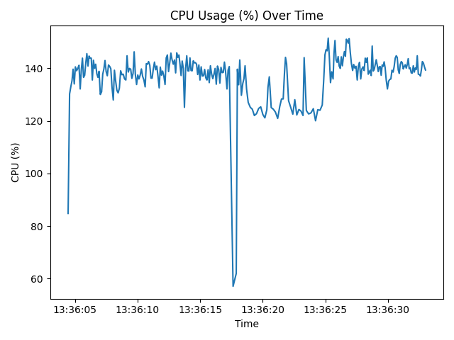
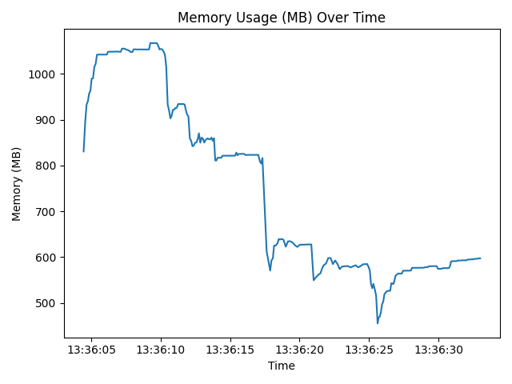

# 基于YOLOv8 + ByteTrack的人脸检测与多目标追踪及静态图库人脸识别

## 项目简介

本项目实现了结合YOLOv8人脸检测模型和ByteTrack多目标追踪算法的人脸实时检测、跟踪与识别功能，并能够利用静态人脸图库进行身份识别。通过对摄像头实时视频流进行处理，可高效实现人脸识别与标注，支持中文显示。

## 功能说明

1. **加载已知人脸图片**：

   * 从指定文件夹加载图片，图片文件名即为人物姓名。
   * 提取并缓存人脸特征编码。

2. **实时人脸检测与追踪**：

   * 使用YOLOv8进行人脸检测。
   * 使用ByteTrack进行多目标追踪，准确跟踪人脸运动轨迹。

3. **人脸识别与标记**：

   * 对每个追踪到的人脸进行特征编码。
   * 与缓存的已知人脸特征进行比对识别。
   * 已识别的人脸标注姓名，未识别的标注为“Unknown”并用高亮框标出。

## 环境安装

项目运行所需Python依赖包：

```shell
pip install ultralytics opencv-python face_recognition pillow
```

## 模型下载

* YOLOv8人脸检测模型（轻量版）：[yolov8n-face-lindevs.pt](https://github.com/lindevs/yolov8-face/releases/latest/download/yolov8n-face-lindevs.pt)

## 使用方法

使用以下命令运行项目：

```shell
python face_tracking.py --known_dir known_faces --source 0 --model yolov8n-face.pt
```

其中：

* `--known_dir`：指定存放已知人脸图片的目录。
* `--source`：指定视频源，`0`为摄像头实时流。
* `--model`：指定YOLOv8模型文件路径。

## 性能表现

项目运行时的资源使用情况统计：

* **CPU 使用率**：最大值151.4%，最小值57.1%，平均值137.08%（样本数量286）
* **内存使用量**：最大值1067.45 MB，最小值455.27 MB，平均值753.04 MB（样本数量286）

资源占用曲线可参见项目中的统计图：

* 
* 

## 效果演示

实时运行效果示例如下图：


## 项目仓库

项目已开源至GitHub，欢迎访问：

* [YoloTrackingYouFace](https://github.com/JiJiBo/YoloTrackingYouFace.git)
