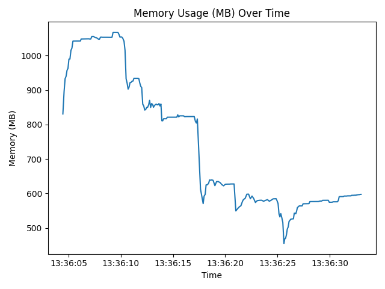

# TrackingFace

## 基于 YOLOv8 + ByteTrack 人脸检测与多目标追踪，以及静态图库人脸识别示例

- 功能：
    1. 加载多张已知人脸图片（文件名即人名），提取人脸特征编码
    2. 对视频/摄像头流进行检测 + 跟踪
    3. 对每个跟踪到的人脸进行识别，匹配已知人脸列表，并根据Track ID缓存姓名
    4. 在画面中标注已识别姓名（支持中文），对于不在已知列表的人脸，用“Unknown”并高亮框出

```shell
pip install ultralytics opencv-python face_recognition pillow
```

```shell
python face_tracking.py  --known_dir known_faces  --source 0  --model yolov8n-face.pt  
```

## 模型地址

- https://github.com/lindevs/yolov8-face/releases/latest/download/yolov8n-face-lindevs.pt

## demo

### === 资源使用统计 ===

- CPU (%) —— 最大: 151.4, 最小: 57.1, 平均: 137.08 (样本: 286)
- Memory (MB) —— 最大: 1067.45, 最小: 455.27, 平均: 753.04 (样本: 286)
  
  
  

## 仓库

- https://github.com/JiJiBo/YoloTrackingYouFace.git